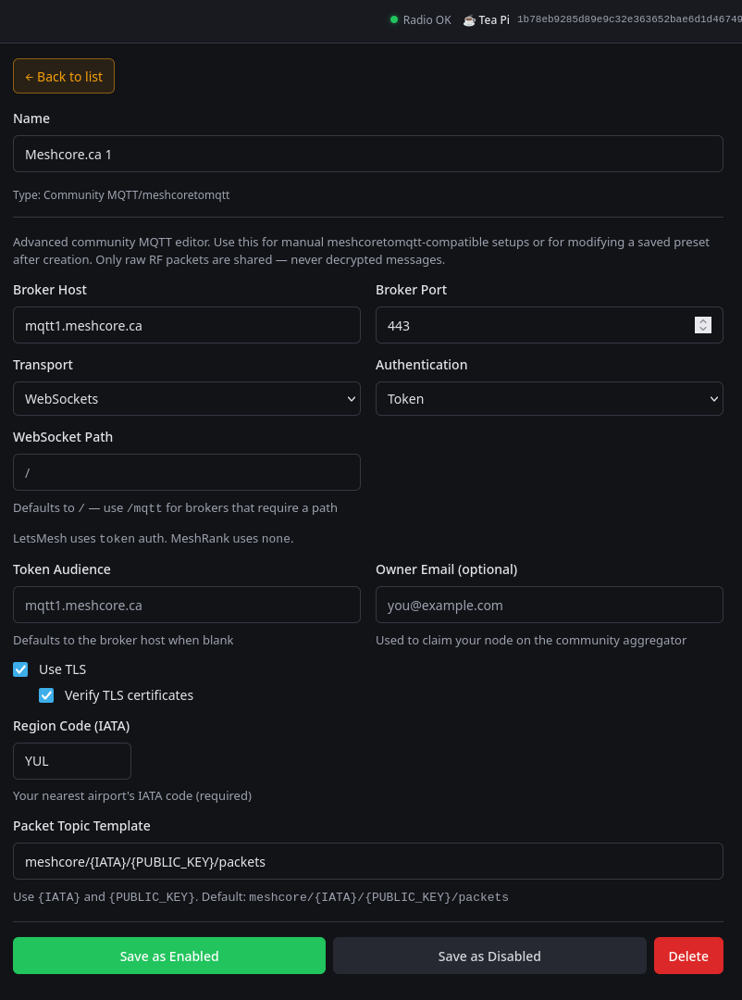

[RemoteTerm for MeshCore](https://github.com/jkingsman/Remote-Terminal-for-MeshCore) can act as an observer by forwarding raw RF packets through its **Community MQTT / meshcoretomqtt** integration. This does not publish decrypted messages.

Install and start RemoteTerm using the upstream instructions, connect your MeshCore radio over serial, TCP, or BLE, then open the RemoteTerm web UI.

## Configure Community MQTT

In RemoteTerm, open **Settings** -> **MQTT & Automation**, add **Community MQTT/meshcoretomqtt**, and use these values:

| Field                   | Value                                                            |
| ----------------------- | ---------------------------------------------------------------- |
| Name                    | `MeshCore.ca 1` or any descriptive name                          |
| Broker Host             | `mqtt1.meshcore.ca`                                              |
| Broker Port             | `443`                                                            |
| Transport               | `WebSockets`                                                     |
| Authentication          | `Token`                                                          |
| WebSocket Path          | `/`                                                              |
| Token Audience          | `mqtt1.meshcore.ca` or leave blank to default to the broker host |
| Owner Email             | Optional                                                         |
| Use TLS                 | Enabled                                                          |
| Verify TLS certificates | Enabled                                                          |
| Region Code (IATA)      | Your nearest real 3-letter IATA airport code                     |
| Packet Topic Template   | `meshcore/{IATA}/{PUBLIC_KEY}/packets`                           |

Click **Save as Enabled**.

## Add the Backup Broker

To publish to the redundant broker as well, add a second Community MQTT integration with the same settings, changing only:

| Field          | Value               |
| -------------- | ------------------- |
| Name           | `MeshCore.ca 2`     |
| Broker Host    | `mqtt2.meshcore.ca` |
| Token Audience | `mqtt2.meshcore.ca` |

Use the same IATA code on both entries.

:::note[Windows MQTT fanout]
If you run RemoteTerm on Windows and enable MQTT fanout, start Uvicorn with `--loop none` as described in the RemoteTerm README so the MQTT client can connect reliably.
:::

## Verify

After saving, use [Check Your Observer](../verify). If the observer connects but no packets appear, confirm the radio is on the MeshCore Canada preset and that RemoteTerm is publishing packet topics, not only status.
