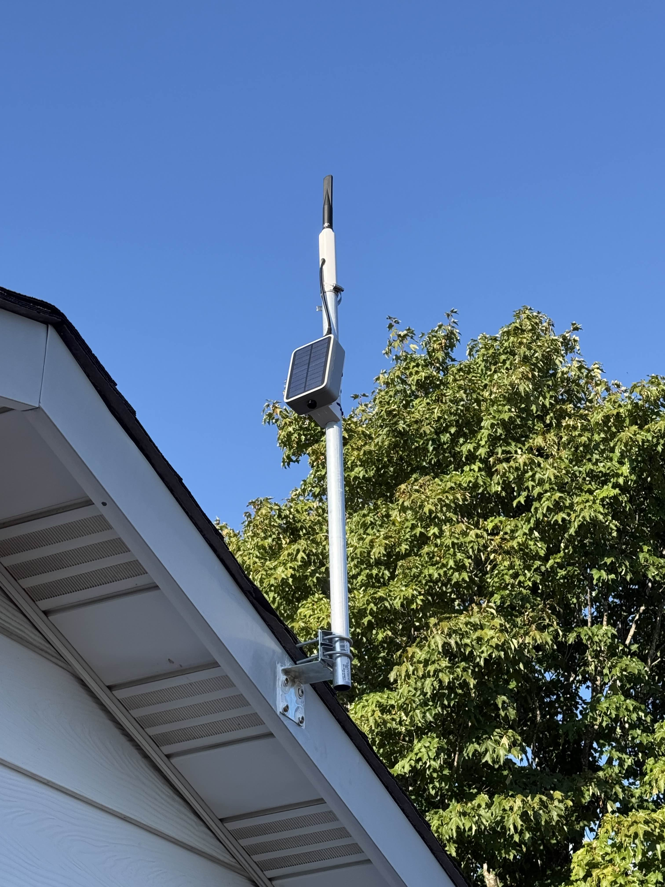
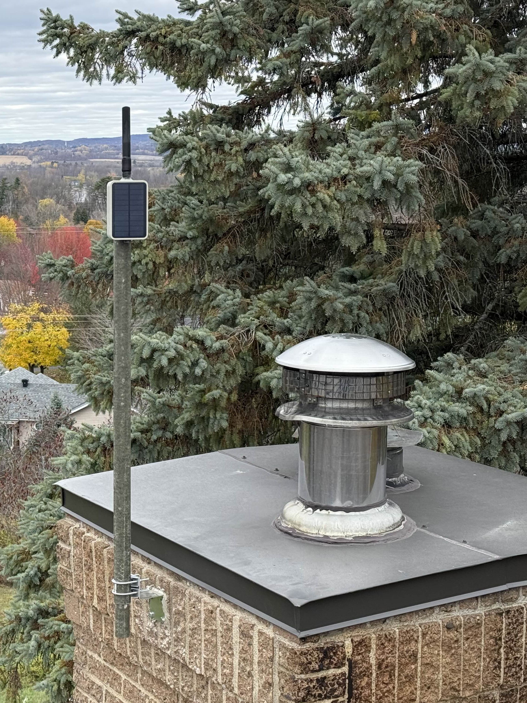
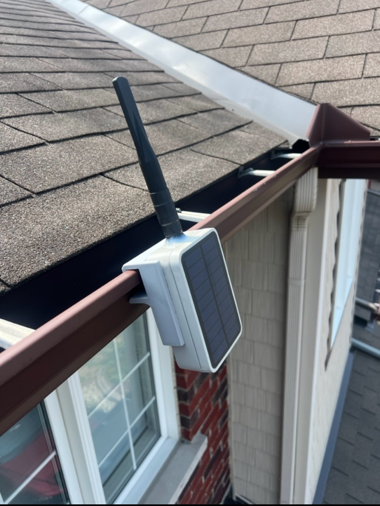
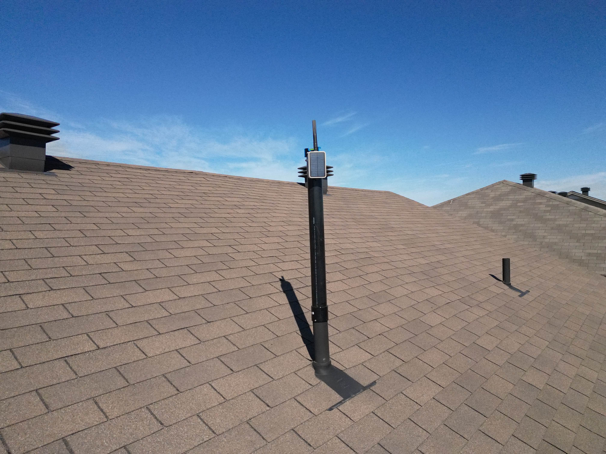

Mounting repeaters securely is critical for good performance and long-term reliability.  
The goal is always to place the antenna as high as possible with clear line-of-sight, while ensuring the mount can withstand wind and weather.

**Remember: Height is might — the higher the node, the better connection you will get to the mesh.**

---

## Mounting Options

### Pole Mount

The most common method is using a standard pole and clamp system.

- Simple to set up with widely available hardware.
- Can be attached to an existing mast, tower, or sturdy pole.
- Best suited for permanent installations where height and stability are required.

Examples of pole mounts:

- [Amazon – Adjustable Pole Mount](https://a.co/d/5U5cT4m)
- [AliExpress – Pole Clamp Option 1](https://www.aliexpress.com/item/1005004943447000.html)
  \*\* [Mounting Guide](https://docs.rakwireless.com/product-categories/wisblock/rakbox-uo180x130x60/installation-guide/#mounting-guide)
- [AliExpress – Pole Clamp Option 2](https://www.aliexpress.com/item/1005004943650198.html)

Examples of poles:

- [Princess Auto - 4ft Army Tent Pole](https://www.princessauto.com/en/4-ft-army-tent-pole/product/PA0009280777)
  \*\* Can be linked together to increase pole length (ensure proper anchoring)
- [3/4 x 36-inch steel tube](https://www.homedepot.ca/product/paulin-3-4-x-36-inch-round-steel-tube/1000126774)

**Pole mount Alfa 5.8dBi Antenna**

Stéphane P created this 3D print to allow pole mounting of the Alfa 5.8 dBI Antenna

- [Download STL](https://drive.google.com/file/d/1wIU9kLxolzM9vPUB35ETY1sCPLGvtfFu/view?usp=share_link)

**Pole mount on chimney**

---

### Gutter Mount

Community member **Aussiemandias** designed a specialized 3D printable gutter mount for quick and discreet repeater installation.

- Ideal for residential areas where pole mounting isn’t practical.
- Attaches directly to house gutters without the need for drilling into walls.
- Provides a stable base while keeping the antenna elevated.

- [Download STL](https://drive.proton.me/urls/A0P57SRHT0#voPRasptRVbW)

---

### Vent Pipe Extension Mount

- Standard 3 foot ABS pipe from Home Depot, 3" in diameter.
- ABS cement on the one side attached to the extension and on the side attached to the house two self-tapping screws in both sides as a safety measure, which allows removal in the future.

---

## Notes

- Regardless of mount type, always ensure the mount and fasteners are weather-rated and can handle local wind conditions.
- Periodically inspect mounts for wear, corrosion, or loosening.
- These options are specifically for the recommended solar repeater build, linked here: [Building a Solar Node – Rak Unify Box](../repeater-solar-300mw-diy-build).
