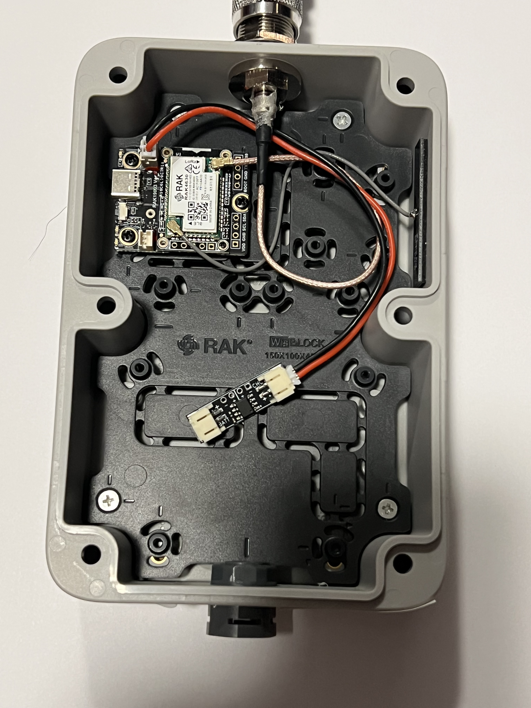
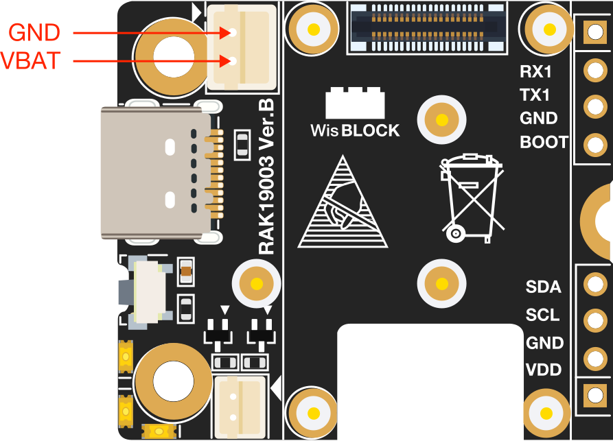
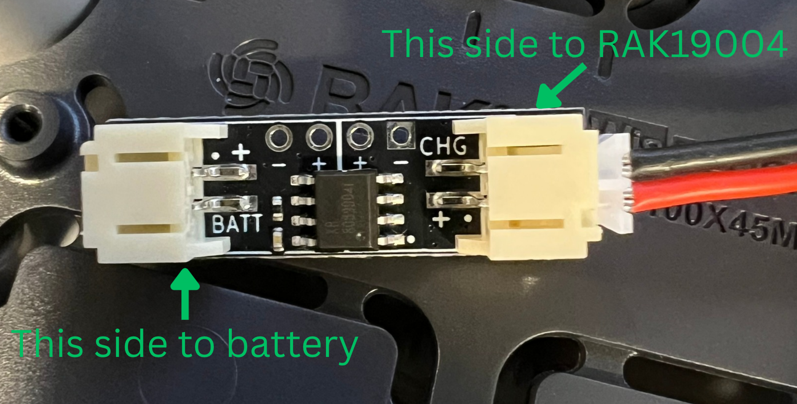
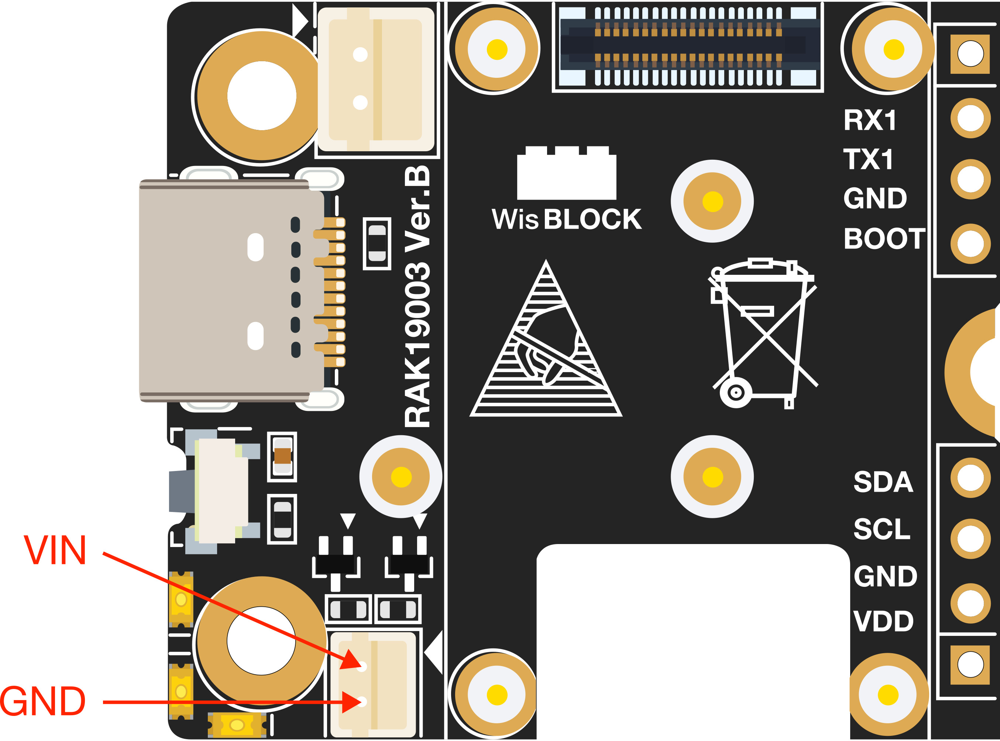
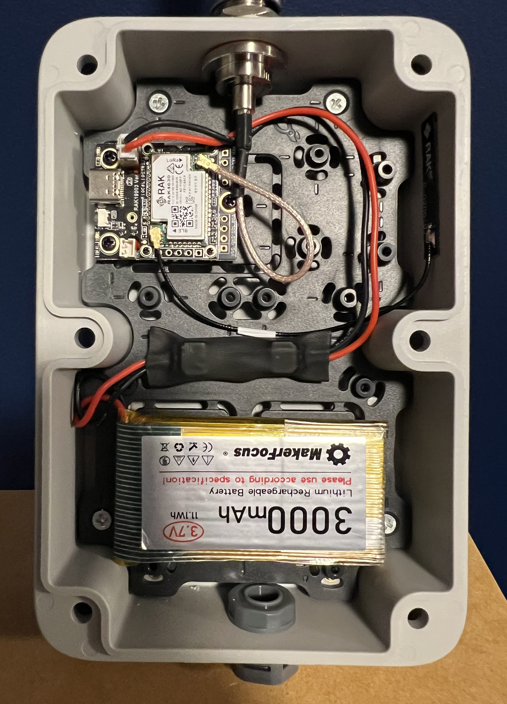
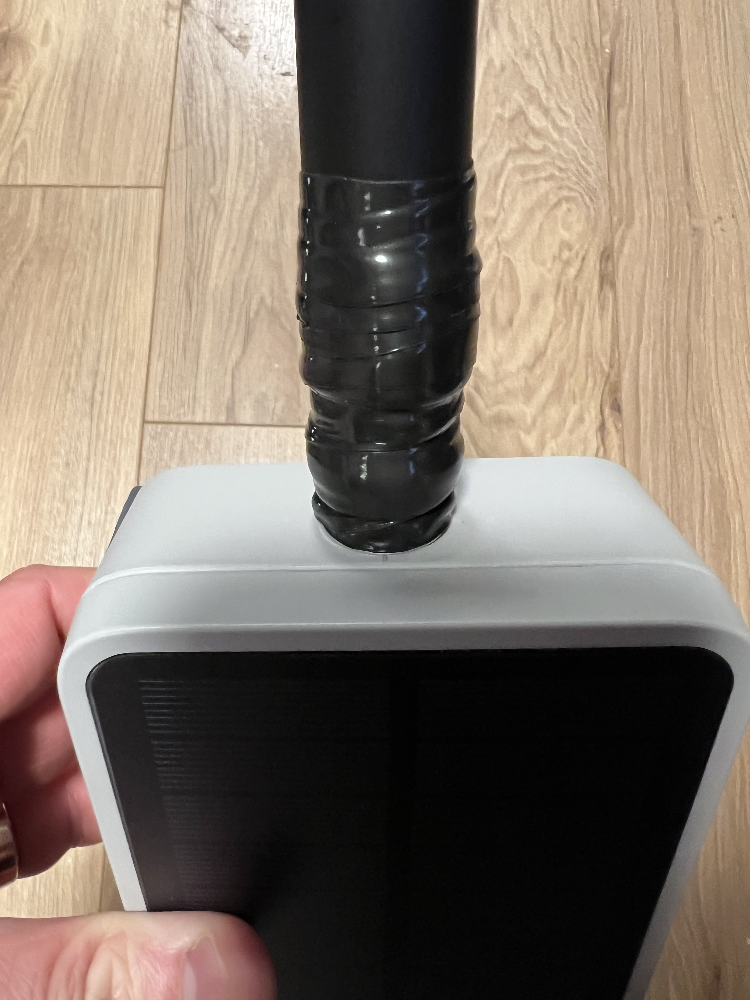
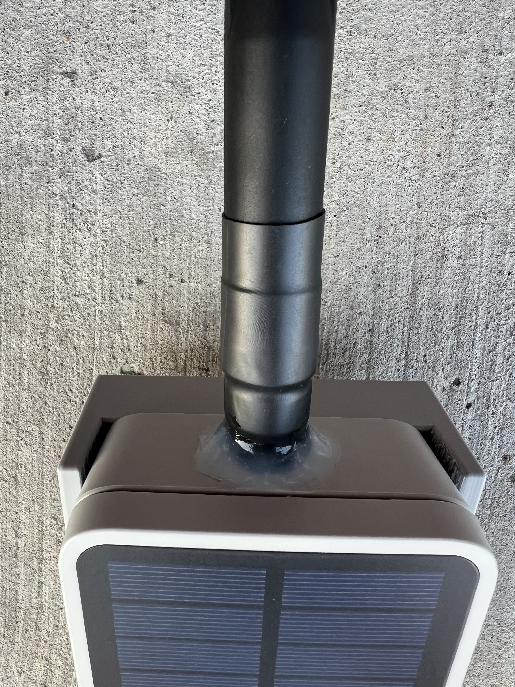

Authored By: MrAlders0n (Ottawa)

:::caution[No warranty]
This is to help the community understand how to make a repeater, and I by no means provide any warranty for anyone following this guide. Please test everything first with a multimeter and other tools before powering anything on.
:::

This guide walks through assembling a solar-powered MeshCore repeater using the **RAK Unify Box** enclosure.  
Follow each step carefully for a reliable and weatherproof build.

## Parts List

| Item                     | Product Name                                               | Cost (CAD) | Link                                                                                                                                |
| ------------------------ | ---------------------------------------------------------- | ---------- | ----------------------------------------------------------------------------------------------------------------------------------- |
| **Enclosure**            | WisMesh Unify Enclosure 910422                             | $72.50     | [AliExpress](https://aliexpress.com/item/1005008369061766.html)                                                                     |
| **LoRa Board (Small)**   | RAK WisBlock RAK19003/RAK4631 (Type 6)                     | $36.38     | [AliExpress](https://aliexpress.com/item/1005008285698839.html)                                                                     |
| **Antenna**              | ALFA AOA-915-5ACM                                          | $34.99     | [Amazon](https://www.amazon.ca/dp/B08H8J6ZV6)                                                                                       |
| **Antenna Coax Cable**   | N Female to IPX                                            | $6.79      | [AliExpress](https://aliexpress.com/item/1005001920963497.html)                                                                     |
| **Battery - Option 1**   | 3000mAh Li-ion - Makerfocus (Pack of 4) - Ships from China | $34.10     | [Makerfocus](https://www.makerfocus.com/products/makerfocus-3-7v-3000mah-lithium-rechargeable-battery-1s-3c-lipo-battery-pack-of-4) |
| **Battery - Option 2**   | 3000mAh Li-ion - Amazon US store (Pack of 4)               | $40.92     | [Amazon](https://www.amazon.com/3000mAh-Rechargable-Protection-Insulated-Development/dp/B08T6GT7DV)                                 |
| **Battery - Option 3**   | 3000mAh Li-ion - Sold at Local store (Space Hedgehog)      | $11.00     | [Space Hedgehog](https://space-hedgehog.com/products/3000mah-battery)                                                               |
| **Battery Protection ^** | Space Hedgehog (Local Store) Li-ion PCM                    | $6.00      | [Space Hedgehog](https://space-hedgehog.com/products/battery-protection-with-low-voltage-cut-off?variant=51646910660664)            |
| **Vent**                 | Waterproof Vent Plug (M12X1.5-10)                          | $6.12      | [AliExpress](https://aliexpress.com/item/1005006370919409.html)                                                                     |

^ If you're using the Makerfocus flat battery: This already includes a PCM, the extra PCM is an added safety measure. If you're using unprotected batteries (e.g., 18650 button top), then you will need to purchase a PCM.

**Approximate total cost: $180 CAD**

---

## Assembly Steps

**WARNING: Always ensure a LoRa antenna and the Bluetooth antenna are attached to the RAK board before powering it on. Powering without antennas can permanently damage the board.**

1. Unbox all components and place them aside.  
   :::tip
   Try not to misplace the small screws and fittings — they’re easy to lose.
   :::

2. Mount the RAK backplate into the box with the four provided screws.

3. Drill two holes: one for the N-type antenna mount and one for the drain plug.
   - Use a step drill bit for clean holes.
   - **Finding the top of the box:**
     - Flip the box onto its back.
     - Locate the mount hole marked "1" — this is the top.
   - Drill slowly, one step at a time. Test-fit the N-type connector after each step until it fits snugly.
   - Repeat the same process on the bottom of the box for the drain plug.

4. Attach both the N-type antenna mount and the drain plug.

5. Connect the N-type antenna to the LoRa IPEX connector on the RAK19003 board.

6. Mount the Bluetooth antenna to the side of the box using the included double-sided tape.

7. Connect the Bluetooth IPEX to the RAK19003 board.

8. Connect an antenna to the N-type connector, then flash and configure the RAK unit following Configuring a Repeater.

9. Mount the RAK unit onto the backplate, see picture below for what it should look like at this step.

   

10. Connect the JST PHR-2 cable to the RAK19003 battery plug, **ensuring correct polarity** (many JST cables are wired incorrectly).

    

11. Connect the other end of this cable to the **CHG** side of the Li-ion PCM. The following picture of the PCM is from VoltaicEnclosures which is what we used initially, but it is the same principle for our current recommended PCM:

    

12. Slide a piece of heat-shrink tubing over the cable large enough to cover the PCM before connecting the battery.

13. Connect the LiPo JST PHR-2 cable to the **BATT** side of the PCM, again **ensuring polarity is correct**.

    

14. Heat-shrink the Li-ion PCM so the entire board is covered.

15. (Optional) Secure the PCM to the backplate using double-sided tape. It can also float freely inside the box if preferred.

16. (Optional) Secure the battery to the backplate with double-sided tape or mounting hardware. It should look like the below image.

    

17. Fit the rubber seal into the groove around the edge of the front plate of the box.

18. Connect the solar panel wire from the front plate to the RAK19003.

    `Be careful not to let the seal fall out of place while connecting the solar panel wire.`

19. Join the front and back plates together and fasten them with the six screws.

    `Tighten securely to maintain the weatherproof seal.`

20. Wrap the entire N-type connector and the exposed metal part of the Alfa antenna with self-adhering silicone tape, or use two layers of heat-shrink tubing for protection.

21. Apply a bead of clear outdoor silicone caulk around the base of the N-type connector to prevent water from leaking into the box.

    
    

22. (Optional) Add a bead of silicone caulk along the top edge of the box seal (between the two plates) and around the base of the antenna as extra waterproofing protection.
