The MeshCore How-To section provides simple, step-by-step guides for the most common tasks you’ll perform on the Ottawa MeshCore network.
Whether you’re sharing your contact URL, importing someone else’s, or tracing multi-hop routes across the mesh, each walkthrough is designed to be clear, visual, and easy to follow.

These instructions use the MeshCore mobile app and apply to both new and experienced users. More guides will be added as the platform grows and as the community discovers useful workflows.

## How to Share Your Contact URL

1. Open the MeshCore app and connect to your node.

2. Tap the **Signal** icon.

   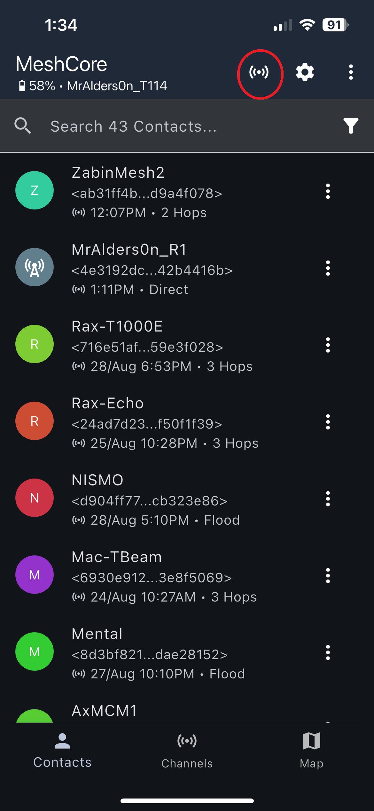

3. Tap **Advert · To Clipboard**.

   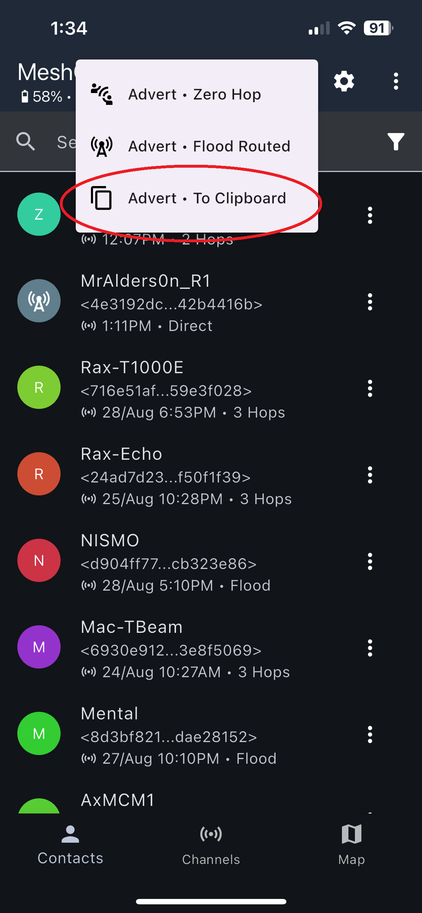

4. Paste your contact URL anywhere you want to share it.

---

## How to Import a Contact URL

1. Open the app and connect to your node.

2. Tap the **three dots**.

   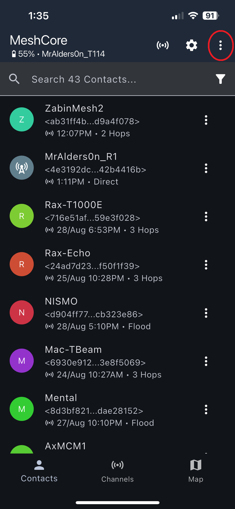

3. Tap **Add Contact**.

   

4. Tap **Import from Clipboard Link**.

   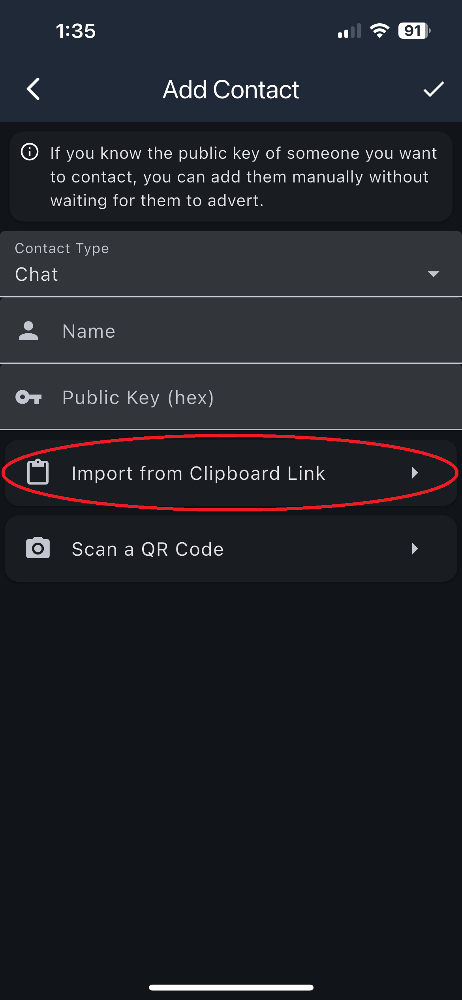

5. After a few seconds you will see "Success - contact has been imported"

   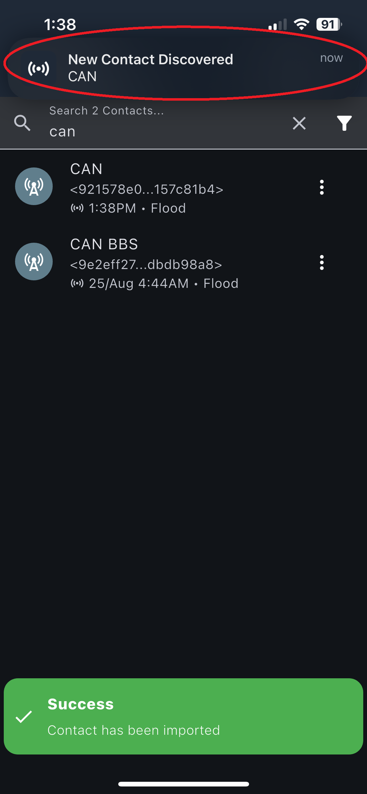

6. A second popup appears: "New Contact Discovered \<NAME\>"

7. The contact is now added.

---

## How to Trace Route to a Node (1 Hop)

1. Open the app and connect.

2. Tap the **three dots**.

   

3. Tap **Tools**.

   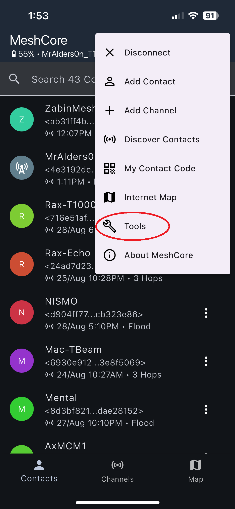

4. Tap **Trace Path · Manual**.

   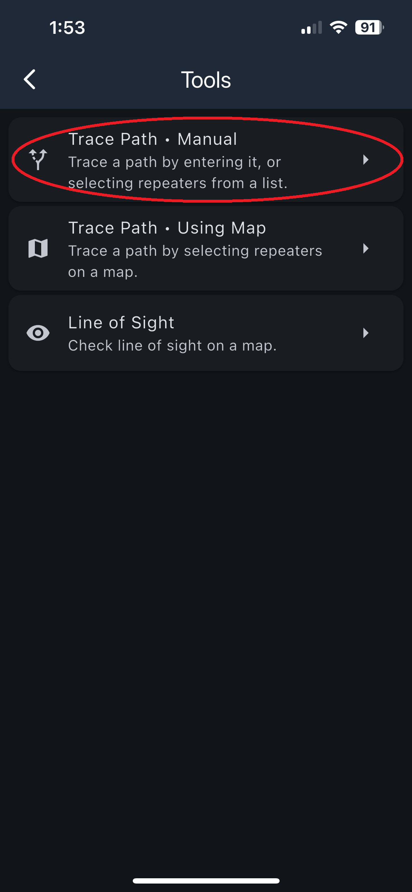

5. Tap the **plus button**.

   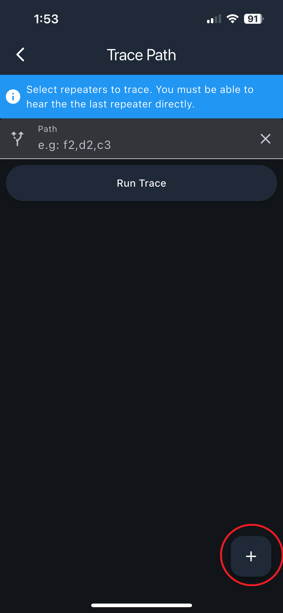

6. Select a repeater and confirm.

   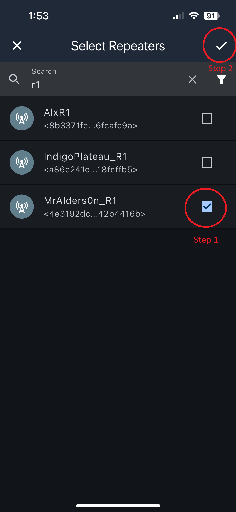

7. You will see one repeater ID; this indicates a **1-hop trace**.

   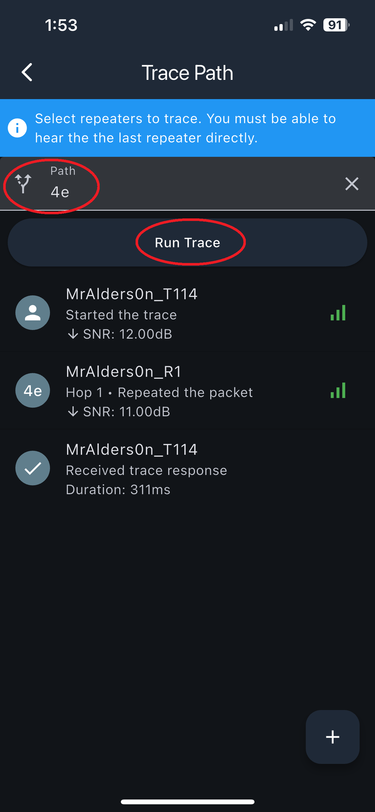

8. Tap **Trace Path**.

---

## How to Trace Route to a Node (2+ Hops)

1. Open the app and connect.

2. Tap the **three dots**.

   

3. Tap **Tools**.

   

4. Tap **Trace Path · Manual**.

   

5. Tap the **plus button**.

   

6. Select repeaters **in order**:
   - Choose the **forward path**
   - Confirm
   - Re-open the add menu and choose the **return path**
   - Or manually enter IDs:
   - Example: `d3, f3, d3`

   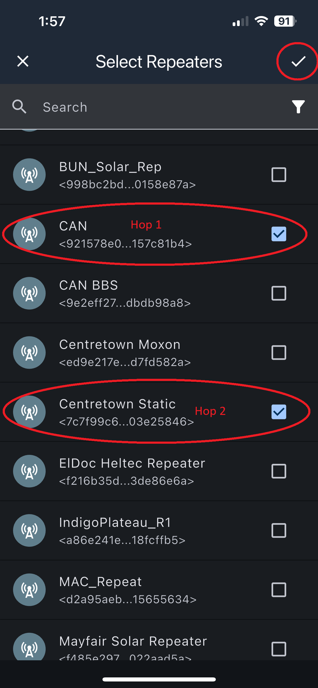

7. Confirm both forward and return paths, then tap **Trace**.

   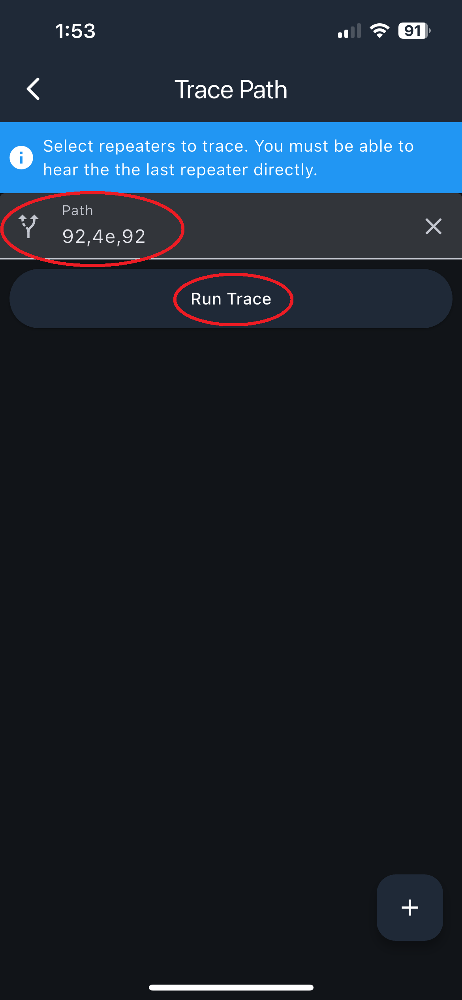

8. View the results.

   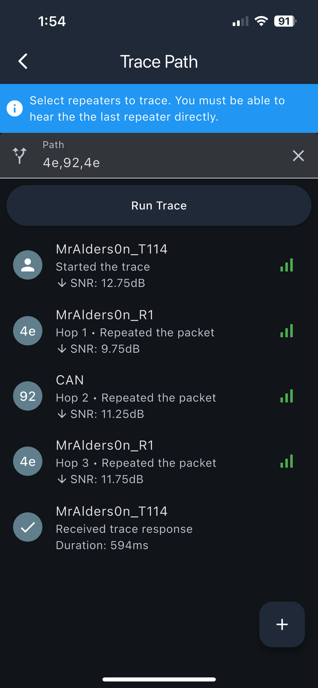

---

## Heard Repeats

In the MeshCore app you can generally see if a repeater heard your message you sent in a channel.

When you send a message out, the packet travels through the airwaves, hits a nearby repeater and it then repeats your packet out. If your companion is within receiving range and receives the repeated packet, it will be counted as a "heard repeat". There are cases where your companion could miss the heard repeat. Examples of this are:

- Your packet makes it to the repeater, but the repeated packet dosn't make it back to your companion.

- If you're using a 1w companion, and the repeater that hears you is a 0.3w. You can send further than it - so while your packet may make it to the repeater, when it repeats your packet it's possible you're too far away to receive it.

## How to Check Heard Repeats

1. Send a message in the public channel.

2. When the app shows **Heard X repeats** under your message, press and hold the message.

   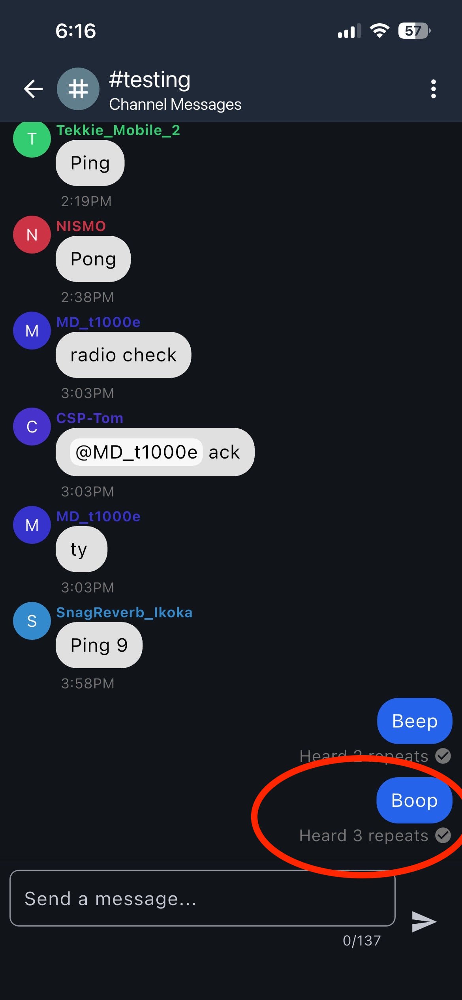

3. Tap **Heard Repeats**.

   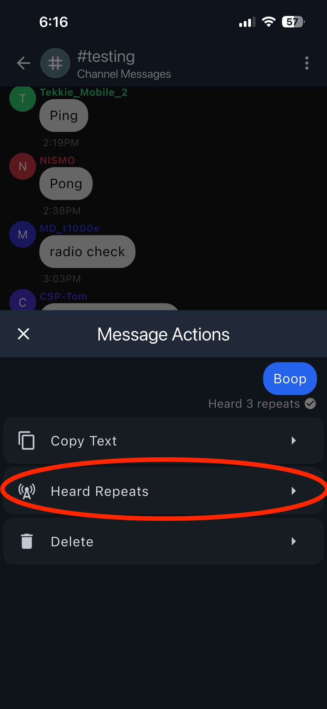

4. You’ll see a list of every repeater your companion heard repeating that packet.

   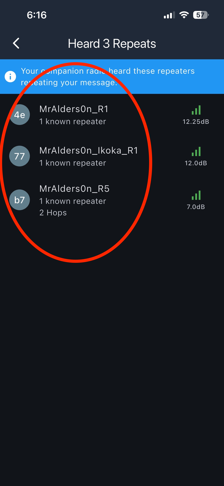

5. Tap a repeater in the list to view the path the repeated packet took to get back to you. See Below for the types of repeats you will see.

### Notes

- A repeater may show up as a **direct hop** if it is close to you.
- You may also see a **distant repeater** listed. This happens when that repeater hears your packet shortly after another one and your companion hears both repeats.
- Your companion must hear the repeater _directly_ for it to appear in this list.

---

### Direct Heard Packet

Below is an example of what a direct heard packet looks like:

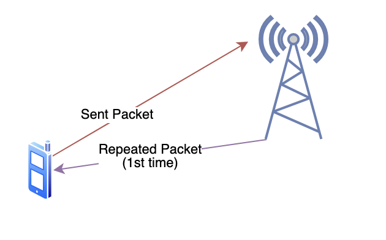

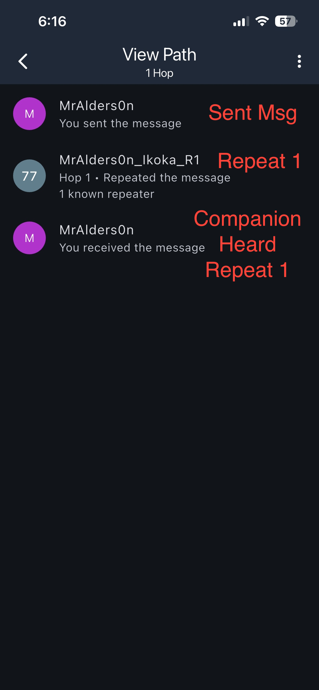

---

### Multi Hop Heard Packet

Below is an example of what it looks like when one repeater hears your message, repeats it, and then your companion hears a second repeater’s repeat of that same packet:

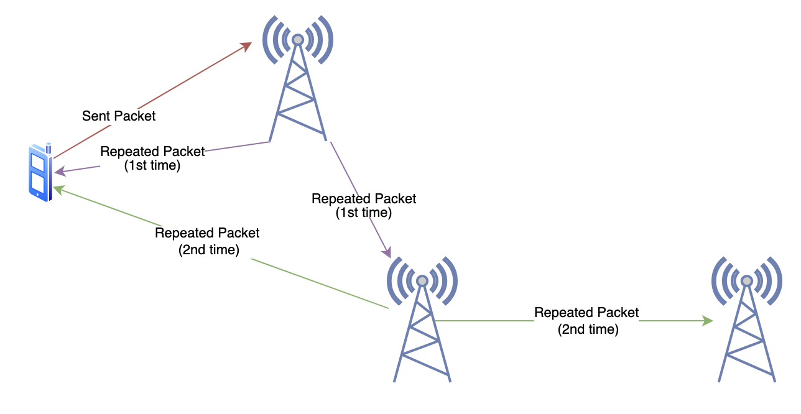

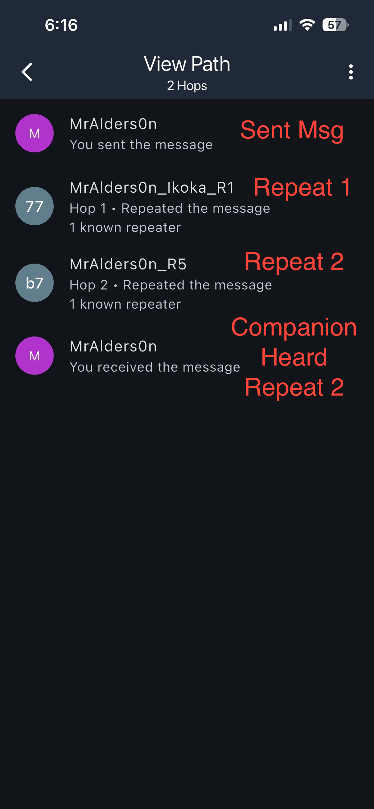
